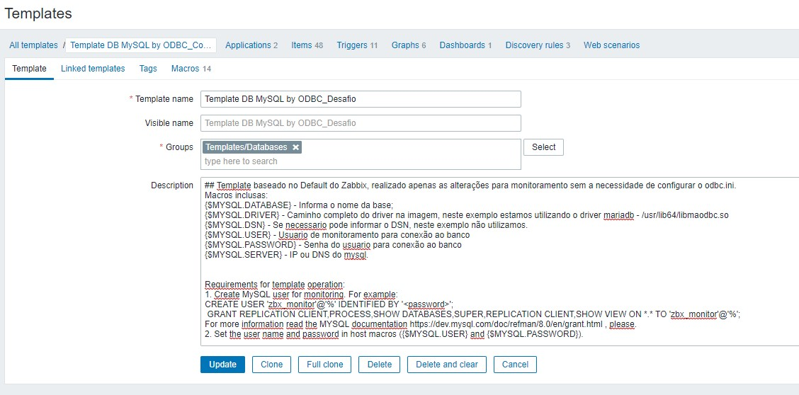
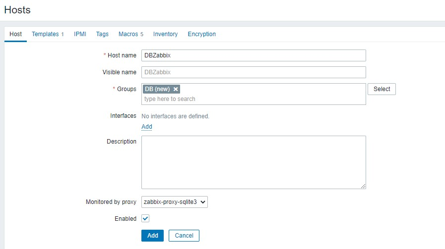
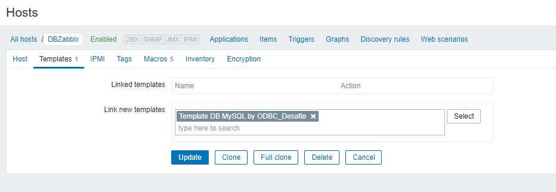
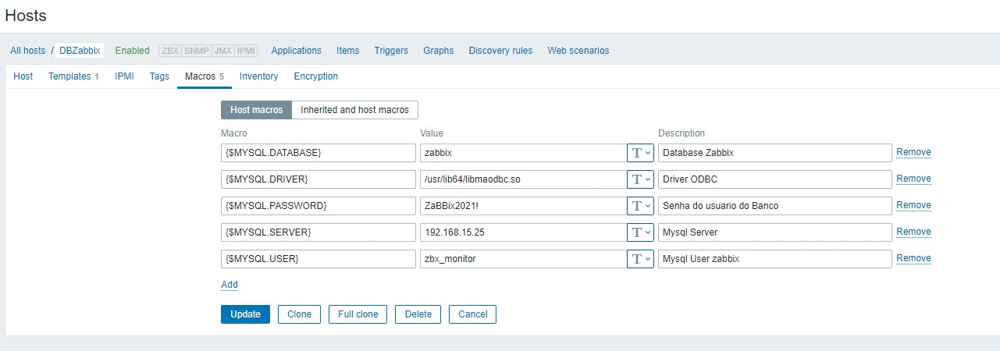
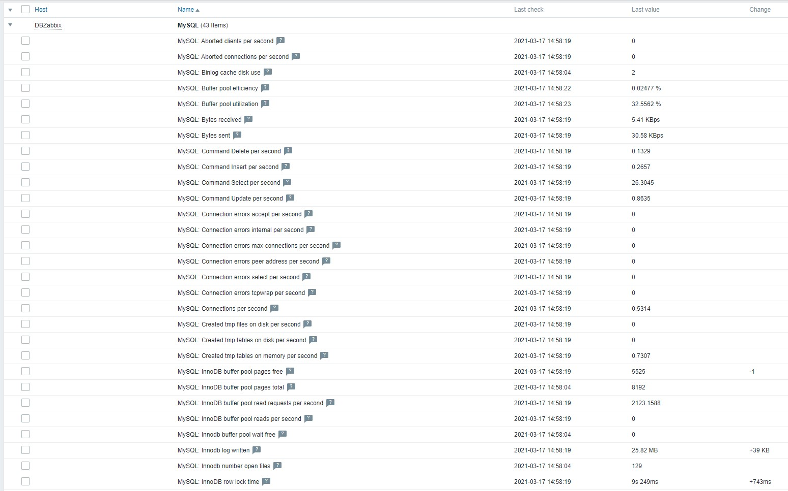
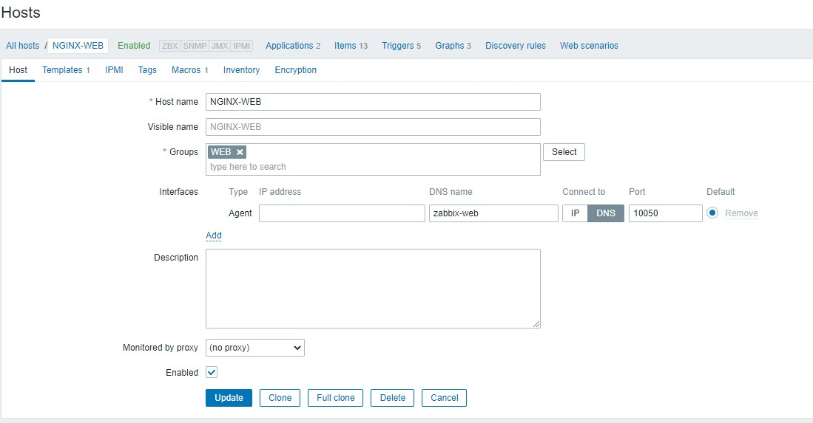
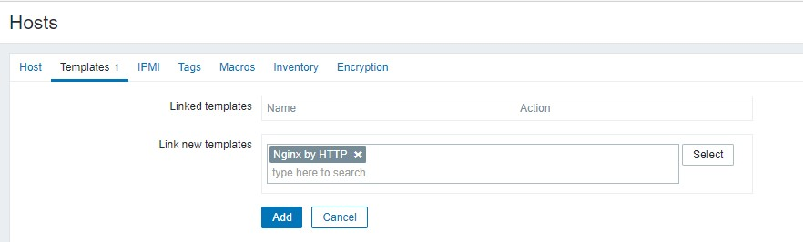
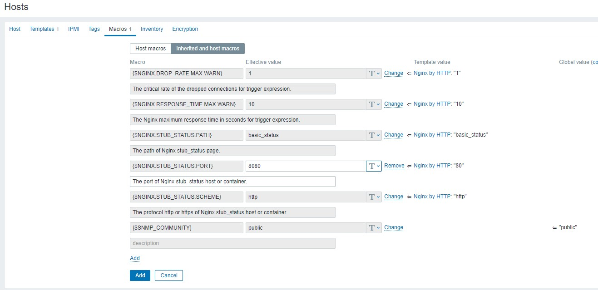
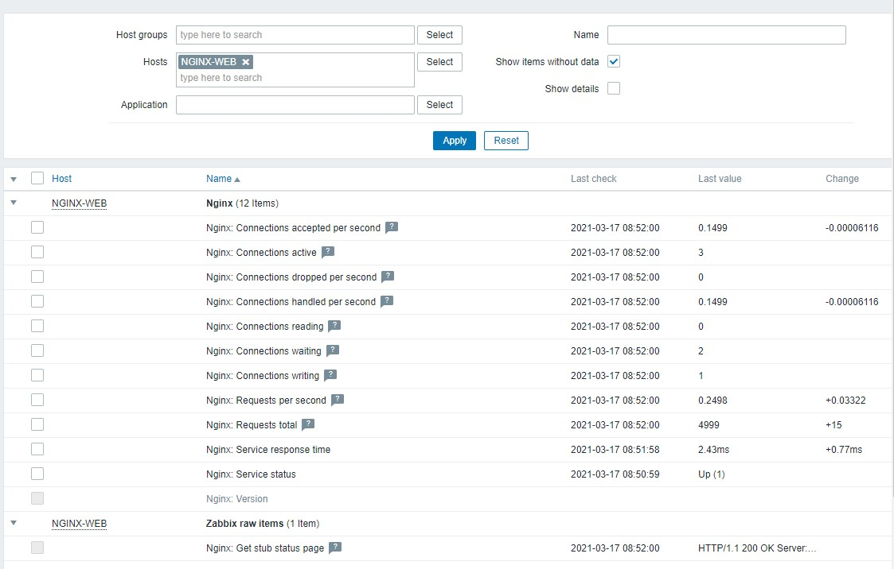

# Tarefas

2)

* Customizar healthcheck de uma das imagens (ex: frontend ou server ou proxy):

Incluso healthcheck no frontend, verificando a porta 8080, para teste altera a linha abaixo para uma outra porta alem da 8080. 
```bash
     test: ["CMD", "curl", "-f", "http://localhost:8080/"]
```
Recrie a stack, que o serviço do zabbix-web não será iniciado.


* Defina pollers de acordo com o ambiente de testes local
Os pollers podem ser definidos nos envs localizados em:

  | Arquivo          | Servico              |
  | ---------------- | -------------------- |
  | common.env       | Time Zone            |
  | zbxagent.env     | Zabbix Agent         |
  | zbxdbmysql.env   | Mysql                |
  | zbxfrontend.env  | Zabbix Frontend      |
  | zbxserver.env    | Zabbix Server        |
  | zbxproxy.env     | Zabbix Proxy         |
  
* Introduzir alguma nova feature em alguma imagem (ex: externalscripts, drivers odbc..)
Instalado mariadb-connector-odbc.x86_64 na imagem do zabbix-proxy-sqlite3
Cadastre o proxy no Frontend do zabbix para realizar os teste.
	Menu > Administration > Proxies > Create Proxy.
	Name: zabbix-proxy-sqlite3
	Save

* Realizar deploy no swarm/kubernetes local
	* Usar uma ferramenta para deploy automatizado será um diferencial
	O projeto pode ser automatizado com o Jenkins entregando, entregando o Repositorio por completo e iniciando a stack no servidor remoto. Para este fim, poderá ser preciso fazer algumas modificações, como por exemplo:
	* No zbxproxy.env altera o variavel ZBX_HOSTNAME=ZBXPROXY-{{.Node.Hostname}}, isso setará um hostname no proxy conforme o hostname do Docker Host
    * Há possibilidade tambem de utilzar Variaveis do Jenkins para preenchimento dos das variaveis DB_SERVER_HOST, MYSQL_USER, MYSQL_PASSWORD, MYSQL_DATABASE, ZBX_SERVER_NAME ou qualquer outra da stack, facilitando assim o deploy em diferentes ambientes.

3) Crie uma monitoração para serviço qualquer para ser monitorado por uma instância de zabbix 5.2

	* Monitoramento da base de dados (Mysql) do Zabbix via ODBC, atraves de Connection String, customizado a imagem do proxy para ser instalado o drive de conexão do mysql e realizar o monitoramento do banco.

	Importe o template em anexo  Template DB MySQL by ODBC_Desafio.yaml disponivel dentro da pasta Templates 
	Obs: ## Template baseado no Default do Zabbix, realizado apenas as alterações para monitoramento sem a necessidade de configurar o odbc.ini.
	
  | Marcro           | Descricao             |
  | ---------------- | -------------------- |
  | {$MYSQL.DATABASE}| Informa o nome da base |
  | {$MYSQL.DRIVER}  | driver mariadb - /usr/lib64/libmaodbc.so  |
  | {$MYSQL.DSN}     | Se necessario pode informar o DSN, neste exemplo não utilizamos.   |
  | {$MYSQL.USER}    | Usuario de monitoramento para conexão ao banco |
  | {$MYSQL.PASSWORD}| Senha do usuario para conexão ao banco |
  | {$MYSQL.SERVER}  | IP ou DNS do mysql |
  
  Tipo de monitoramento: "Database Monitor"
  Responsavel por monitorar a saude do Mysql e tamanho da bases do Mysql. Utilizando connection String, recurso recente do zabbix.
 
 * Importe o Template: Configuration > Templates > Canto superior direito > Import, Importe o template em anexo (Template DB MySQL by ODBC_Desafio.yaml)	
		
* Crie um host para o banco de dados, informe em interface, o IP do seu Banco. 
	
* Vincule o template importado: Template DB MySQL by ODBC_Desafio.yaml
	
* Altere as macros conforme descrito acima. Se seguiu esta documentação, será preciso apenas alterar o IP do servidor do banco de dados.
	
* Aguarde Coleta, para verificar pode ir em Monitoring > Latest Data > Selecione o host criado e aguarde a coleta.
	


4) A equipe de desenvolvimento XPTO deseja monitorar aplicação web de votação, composta de:
	 **Estudo de Caso: Sistema de Gestão vendas de Passagem.** 
	Reunião de Alinhamento com a equipe de Dev, equipe suporte do sistema e supervisores, para conhecimento da demanda e entendimento do processo atual.
	Pontos discutidos:
	* Do processo:
Serviço consiste em dois servidores rodando no Azure, um para aplicação e outro para banco. Os PDV (agencias), conectam via um sistema web (https://www.vendaspassagem.com.br/vendas, atraves de loguin e senha, para realização do processo de vendas do bilhete, reserva de poltrona e vendas clientes. Todas as vendas são sincronizadas para o ERP da empresa atraves de uma api disponivel em https://www.vendaspassagem.com.br/web/api/v2, onde é informado via json se o horario da ultima sincronização e o status.
	* Sistema está em que local?
		**R:** Sistema rodando em dois servidores hospedados no Azure.
	* Atualmente quais as metricas são monitoradas no sistema.
		**R:** Tempo de resposta para cada passo na venda da passagem da url, é realizado manualmente vendo o historico do navegador; Disponibilidade do sistema, disponibilidade do sistema de vendas, Latencia ( Se variar muito, a conexão é perdida e o processo é interrompido); Utilizando o MTR (WinMTR) e ping. Relatorios de uso de recursos do Azure, para saber consumo de memoria, processamento, disco e banco;
		
	* Quais os ativos que envolvem a solução:
**R:** Servidores Azure, estacoes e internet de pontos de vendas.

	* Entregaveis pelo monitoramento:
		 1. Monitormaneto da Latencia e disponibilidade do serviço web;
		 2. Disponibilidade de cada passo no processo de vendas; 	Monitoramento de recursos do Azure, atraves de consultas da API;
		 3. Monitoramento de saltos do MTR. 	
		 4.  Monitoramento dos PDVs. 	
		 5.  Saude dos bancos de dados. 	
		 6. Integração com o ERP principal da empresa.
	     7. Consulta na API para saber o status da ultima sincronização realizada.

	* Prazo:
		 1.  Definição de responsabilidades, quem será responsavel pela homologacao quando o monitoramento for entregue.
	   2. Cada ponto entregavel do monitoramento, será entregue de x em x dias, e a partir da data de entrega, a cliente tem x dias para retorno e solicitação de melhorias.

5) Tarefa: A equipe de desenvolvimento XPTO deseja monitorar aplicação web de votação, composta de......
• Frontend
R: Para frontend, monitoramento utilizando monitoramento web (websenarios), verificando tempo de resposta para cada processo (visualização e simulação de envio de votos), com isso é possivel identificar lentidão nos processos envolvendo o frontend (tempo de resposta), codigos http de retorno e velocidade de acesso.
• Backend
R: Depende do ambiente, se for atraves de uma API, é possivel utilizar httpagent para verificar se os dados estão sendo atualizados, status de processo e etcs.
• Banco de dados
R: Utilizaria monitoramento de banco de dados, solicitaria a equipe de desenvolvimento querys para verificar cada opção, com as metricas necessarias criaria os limites, triggers, necessarias para identificar possiveis problemas apresentadas na solução.

6) Determinada aplicação retorna dados apenas no formato YAML conforme exemplo abaixo. Colete esses dados e crie alerta para o campo status diferente de OK.


7) Monitore os acessos ao webserver do frontend do zabbix (através da página de status do webserver 
(nginx ou apache)).
Criado bind no volume do serviço zabbix-web, para mapeamento do nginx.conf (zbx_data/etc/nginx/zabbix/nginx.conf para /etc/zabbix/nginx.conf dentro do serviço), foi incluido o seguinte conteudo.
```bash
        location = /basic_status {
                stub_status;
        }
}
```

Assim quando é acessado a url http://zabbix-web:8080/basic_status, é apresentado um pequeno status do nginx.

```bash
Active connections: 6 
server accepts handled requests
 9 9 17 
Reading: 0 Writing: 1 Waiting: 5 
```
No frontend do zabbix, crie um novo host, na interface, em DNS name, inclua o nome do serviço do frontend, "zabbix-web", e em Connect to altere para DNS, a conexão será feita por DNS e não por IP. Na aba Template pesquise pelo Template "Nginx by HTTP" e por fim, na aba Macros, Clique no botão "Inherited and host macros", para herdar as macros do template e globais, altere a macro {$NGINX.STUB_STATUS.PORT} para porta 8080, conforme as prints em anexo.
Cadastro do host

Vincular Template

Alterar Macros

Aguarde Coleta
